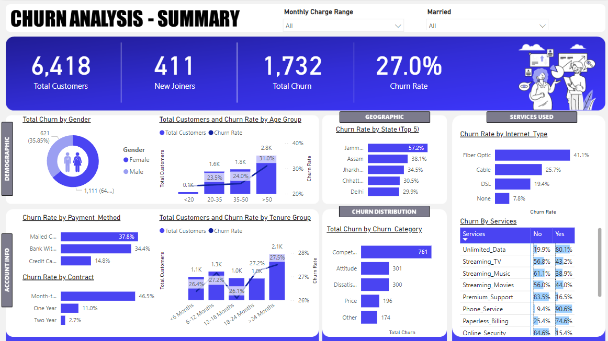

# Telecom Churn Analysis and Prediction

This project focuses on analyzing and predicting customer churn for a telecom company. The workflow includes data analysis and transformation using Microsoft SQL Server, creating an interactive Power BI dashboard for visualization, and building a machine learning model using a Random Forest algorithm to predict customer churn.

---

## Table of Contents

- [Introduction](#introduction)
- [Technologies Used](#technologies-used)
- [Project Workflow](#project-workflow)
  - [Data Analysis and Transformation](#data-analysis-and-transformation)
  - [Power BI Dashboard](#power-bi-dashboard)
  - [Machine Learning Model](#machine-learning-model)
- [Power BI Dashboard](#power-bi-dashboard)
- [Installation and Setup](#installation-and-setup)
- [Contributing](#contributing)
- [License](#license)

---

## Introduction
Customer churn refers to the rate at which customers stop doing business with an entity. Understanding churn can help businesses take action to retain customers and improve revenue. This project aims to analyze churn data, visualize it through a Power BI dashboard, and predict potential churners using a machine learning model.

---

## Technologies Used

- **Microsoft SQL Server**: For data analysis and transformations.
- **Power BI**: For creating interactive dashboards and visualizations.
- **Python**: For building the machine learning model.
- **Random Forest Algorithm**: For predictive modeling.

---

## Project Workflow

### Data Analysis and Transformation
- The churn data was ingested into Microsoft SQL Server.
- Performed various transformations and analysis to clean and prepare the data.
- Key metrics and dimensions were identified, including demographics, geography, payment methods, and services.

### Power BI Dashboard
- Created a comprehensive Power BI dashboard for visualizing churn data.
- Visualizations include insights based on demographics, geography, payment methods, and services.
- The dashboard provides actionable insights to reduce churn and improve customer retention.

### Machine Learning Model
- Used the prepared data to build a machine learning model.
- Implemented a Random Forest algorithm to predict which customers are likely to churn among new joiners.
- Evaluated model performance using metrics such as accuracy, precision, recall, and F1 score.

---

## Power BI Dashboard

